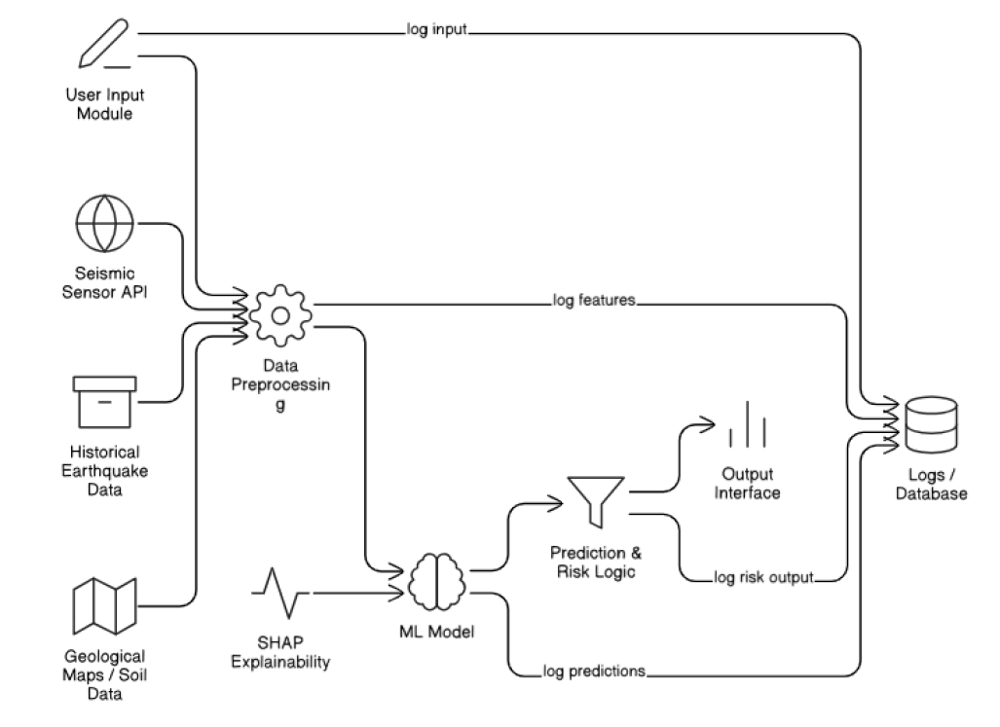

# 🌍 ImpactSense – Earthquake Impact Prediction  

## 📌 Project Statement  

The **ImpactSense** project aims to build a **machine learning-based predictive model** that estimates the potential impact of earthquakes — including **magnitude, damage level, or risk zone classification**.  

Using **geophysical & environmental data** such as latitude, longitude, depth, seismic wave features, and geological parameters, the system can:  

✔️ Assess possible damage  
✔️ Categorize earthquake severity  
✔️ Aid **disaster planning, emergency response, and public awareness**  

---

## 🎯 Use Cases  

### 🏙️ Urban Risk Assessment  
- **Description:** Predict the level of earthquake impact in populated regions using historical data.  
- **Example:** Identify regions most at risk during a **5.5 magnitude earthquake** based on soil type & location.  

### 🏗️ Infrastructure Planning  
- **Description:** Help city planners create safer construction policies in high-risk areas.  
- **Example:** Predict risk level using **soil density** & **fault-line proximity**.  

### 🚨 Government Disaster Response  
- **Description:** Enable emergency teams to prioritize response & rescue.  
- **Example:** Rank regions for **aid delivery** after an earthquake.  

---

## 🎓 Learning Outcomes  

By the end of this project, students will:  

- 📊 Understand seismic data & earthquake impact modeling  
- 🧹 Preprocess & analyze geospatial features  
- 🤖 Train & evaluate ML models for classification/regression  
- 💻 Optionally deploy with a simple **UI (Streamlit / FastAPI)**  
- 📈 Document results with visualizations  

---

## 📂 Dataset  

- **Source:** Kaggle  

---

## 🏗️ System Architecture  

  

---

## ⚙️ Modules to be Implemented  

### 🔹 1. Data Exploration & Cleaning  
- Handle missing values, duplicates  
- Visualize **magnitude, depth, latitude, longitude**  

### 🔹 2. Feature Engineering  
- Normalize/scale numeric features  
- Add geospatial clusters or risk score  
- Encode categorical columns  

### 🔹 3. Model Development  
- Baseline models: Logistic Regression, Random Forest, XGBoost  
- Advanced models: Gradient Boosting, Non-linear models  

### 🔹 4. Model Evaluation  
- Metrics: Accuracy, MAE/MSE, F1-score  
- Visuals: Confusion Matrix, Feature Importance  

### 🔹 5. User Interface (Optional)  
- Simple web form (Streamlit/FastAPI)  
- **Input:** magnitude, depth, region, soil type  
- **Output:** predicted impact / risk category  

---

## 📅 Milestones  

### **Milestone 1**  
- Week 1: Project Setup & Dataset Understanding  
- Week 2: Preprocessing & Feature Engineering  

### **Milestone 2**  
- Week 3: Baseline Models (Logistic Regression, Decision Tree)  
- Week 4: Advanced Models (Random Forest, Gradient Boosting)  

### **Milestone 3**  
- Week 5: Evaluation (Confusion Matrix, MAE/MSE, SHAP values)  
- Week 6: UI Prototype (risk predictor form)  

### **Milestone 4**  
- Week 7: Testing & Improvements  
- Week 8: Final Report, Visualizations & Presentation  

---

## 🛠 Tech Stack  

- **Programming Language:** Python 🐍  
- **Libraries:** Pandas, NumPy, Scikit-learn, XGBoost, Matplotlib, Seaborn  
- **Visualization:** Plotly, SHAP (explainability)  
- **Deployment:** Streamlit / FastAPI (optional)  
- **Dataset Source:** Kaggle  

---

## ⚡ Installation & Usage  

1. Clone this repository  
   ```bash
   git clone https://github.com/your-username/ImpactSense.git
   cd ImpactSense
